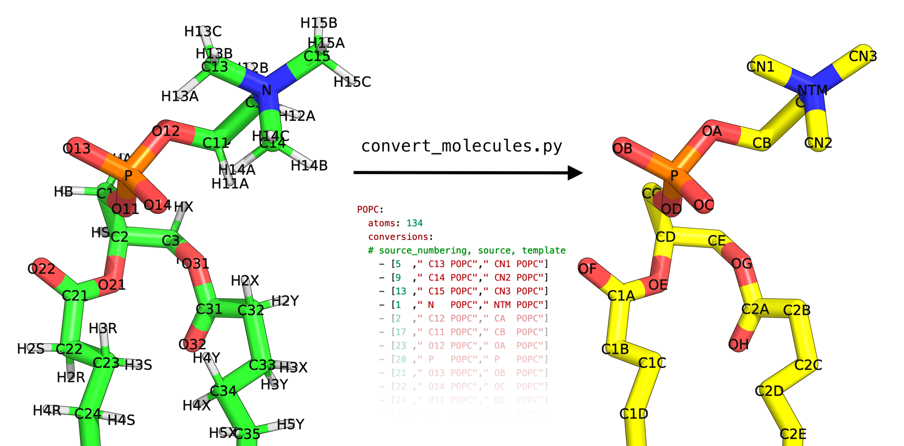

# CHARMM-GUI_GROMOS_conversion_tutorial
CHARMM-GUI creates systems ready for simulation but with charmm parameters, this can be converted to the amber format using `charmmlipid2amber.py`. Conversion to a united atom forcefield like `GROMOS-54A7` requires changing the number of atoms to a united atom represenation which is not supported by `charmmlipid2amber.py`.

The `convert_molecules.py` script developed here enables AA to UA conversion using templates, i.e. the included `charmm_to_gromos.yaml` file, see figure below:



## Tutorial
*Files for this tutorial may be found in XXX*
* Here I have generated a small CHARMM-GUI system `step5_input.pdb` (nAChR with nicotine bound and embedded in POPC membrane)
* The `step5_assembly.str`
* The `NCT_prot_het.pdb` file was created by processing the protein through [`pdb2gmx`](https://manual.gromacs.org/documentation/2021/onlinehelp/gmx-pdb2gmx.html) and adding the ligand (nicotine) to the file.
  * Used the GROMOS-54A7 forcefield for the ligand 
  * Generated parameters for nicotine using ATB, [they can be found here](https://atb.uq.edu.au/molecule.py?molid=703425)

### Inserting the UA-protein into the CHARMM-GUI system
1. Load both `step5_input.pdb` and `NCT_prot_het.pdb` into VMD (assuming they have molid 0 1 respectively)
2. Align the protein from `NCT_prot_het` on `step5_input`, commands to be entered in `TkConsole`
```
set ref [atomselect 0 "protein and name CA"]
set target [atomselect 1 "protein and name CA"]
set all [atomselect 1 all]
$all move [measure fit $target $ref]
```
3. Optional step, if your protein is not centered in the box, i.e. poking out the top, use the [`shift_solvent.tcl`](https://github.com/askusay/MD_box_fixer) vmd scritpt to fix it
4. Save the adjusted `NCT_prot_het` structure -> `NCT_prot_aln.pdb`
5. Save the `step5_input` structure without the protein or ligand atoms -> `step5_mem_ion.pdb`:
  * Example selection: `not (segid "PRO[A-Z]" "HET[A-Z]")`
6. Combine the `NCT_prot_aln.pdb` and `step5_mem_ion.pdb` files:

```
cat NCT_prot_aln.pdb step5_mem_ion.pdb > NCT_comb.pdb
```
* **IMPORTANT:** remove the **END** and **CRYST1** lines between the atoms in the joined files!

### Running `convert_molecules.py`:
